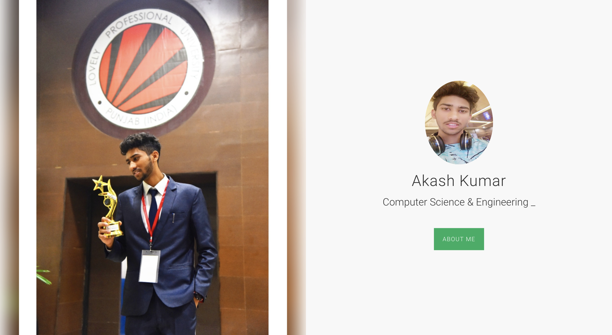

    

## 🔰 An Insight

I initiated this project as Personal Portfolio website. But it is much more than that. Which is like my resume that have covered my Education, Final year project, Experience, Acheivement and skills.

## ScreenShot:

 ### 🔥  Contribution

 Your contributions are always welcome and appreciated. Following are the things you can do to contribute to this project.

 1. **Report a bug**  
 If you think you have encountered a new issue, and I should know about it, feel free to report it [here](https://github.com/akashkumar916/Portfolio/issues/new) and I will take care of it.

 3. **Create a pull request**  
 It can't get better then this, your pull request will be appreciated by the community. You can get started by picking up any open issues from [here](https://github.com/akashkumar916/Portfolio/issues) and make a pull request.

#### View my Portfolio : <a href="https://akashkumar916.github.io/Portfolio" target="_blank">here</a>

